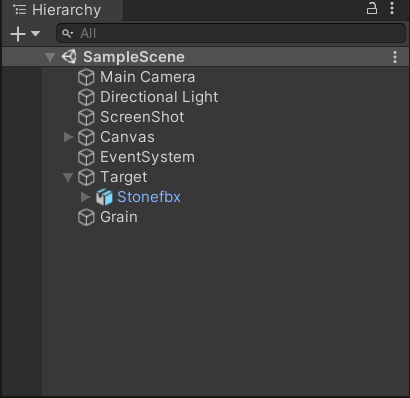
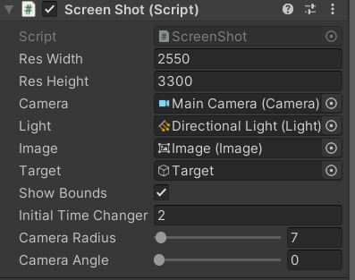

# Dataset From 3D

This repo helps out you creating Dataset Images out of 3D models.

## Getting Started

1. Import the 3D model you'll be using.
2. Adjust the hierarchy and place the 3D model as a child of the Target GameObject
3. Press Play
4. A Screenshot folder will be created in the Desktop
5. Leave it running

You may tweak the Screenshot GameObject to achieve different results

